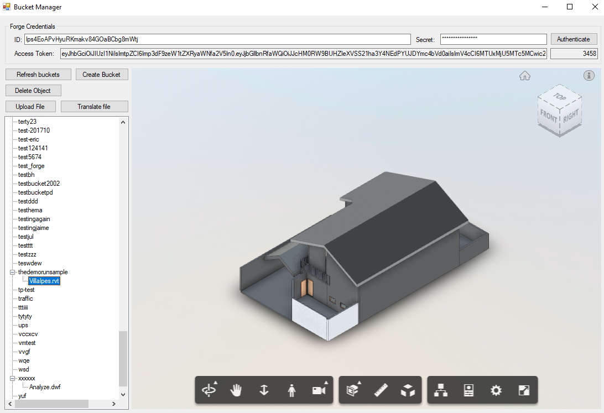

# bucket.manager-csharp-sample.tool

This sample is a Windows desktop application that lists all buckets for a given Forge Client ID & Secret, allow creating new buckets, upload new files, translate and delete. It is intended as tool for developers.

## Demonstration

## Setup

For using this sample, you need an Autodesk developer credentials. Visit the [Forge Developer Portal](https://developer.autodesk.com), sign up for an account, then [create an app](https://developer.autodesk.com/myapps/create).

Download the repository, open `bucket.manager.sln` Solution on Visual Studio. The build process should download the required packages (**Autodesk.Forge** and dependencies). Run the project. At the form, enter your Client ID & Secret, click on **Authenticate** button. The app will obtain a 2-legged token and list buckets and files. After translating, files should be Viewable.

### Tips & Tricks

The CEF Sharp library should work on `AnyCPU`, but this sample uses only `x64` version. [This issue](https://github.com/cefsharp/CefSharp/issues/1714) entry explains how to adjust it, if needed.

## License

This sample is licensed under the terms of the [MIT License](http://opensource.org/licenses/MIT). Please see the [LICENSE](LICENSE) file for full details.

## Author

Forge Partner Development Team

- Augusto Goncalves [@augustomaia](https://twitter.com/augustomaia)

See more at [Forge blog](https://forge.autodesk.com/blog).